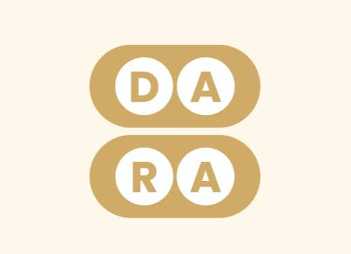

<p align="center">
  
</p>

<h1 align="center">Dara Contract</h1>

<p align="center">
  Contract architecture and Soroban research for a digital Ayo strategy game.
</p>

---

## Overview

Dara is a digital Ayo strategy game project exploring how Stellar and Soroban can support on-chain game infrastructure.

This repository is planned to contain contract architecture, Soroban research, match record design, reward flow documentation, and future smart contract implementation for Dara.

The repository is currently documentation-first. It is intended to prepare the contract scope before a Soroban implementation is added, so contributors can agree on what belongs on-chain, what should stay in the frontend or backend, and how future contract work should be tested.

## Project Vision

Dara aims to preserve and modernize Ayo gameplay while exploring blockchain-supported features such as:

- Player identity
- Match records
- Result verification
- Tournament participation
- Rewards and payouts
- Soroban-powered game infrastructure

## Repository Scope

This contract repository is responsible for planning and, later, implementing the blockchain layer for Dara.

In scope:

- Soroban contract architecture notes
- Match record and result verification design
- Player identity and wallet interaction research
- Tournament and reward flow documentation
- Future proof-of-concept contract code
- Contract test planning and validation notes

Out of scope:

- Frontend board UI implementation
- Mobile gameplay interface work
- Off-chain game session hosting
- Production wallet onboarding UI
- Final tokenomics or payout policy decisions

Those areas may be documented here when they affect contract boundaries, but implementation should live in the appropriate frontend, backend, or governance repository when those repositories exist.

## Planned Contract Work

- Soroban match architecture documentation
- Match creation and joining design
- Game result verification design
- Stellar reward and tournament flow research
- Test planning for match logic
- Future proof-of-concept Soroban contract implementation

## Stellar/Soroban Roadmap

Planned work includes:

- Researching on-chain versus off-chain game-state responsibilities
- Designing Soroban storage for match records
- Documenting Stellar payment and reward flows
- Building a proof-of-concept match contract
- Creating tests for future match logic

## Current Repository Structure

```text
dara_contract/
  assets/                 Dara logo and static project assets
  docs/                   Drips and contribution planning notes
  CONTRIBUTING.md         General contribution guidance
  README.md               Contract repository overview
```

No Soroban source package is committed yet. Until contract code is added, most work will be documentation, architecture, issue planning, and contributor setup improvements.

## Setup Notes

For documentation-only contributions:

```bash
git clone https://github.com/daarraa/dara_contract.git
cd dara_contract
```

Then edit Markdown files and review the diff before opening a pull request:

```bash
git diff --check
```

For future Soroban development, contributors should expect setup steps similar to:

1. Install Rust and Cargo.
2. Install the Stellar CLI.
3. Add a Soroban workspace when contract code is introduced.
4. Run contract formatting, build, and test commands documented by the first contract implementation PR.

This repository does not yet define canonical contract build commands. Do not add placeholder commands that imply a Soroban package already exists.

## Future Soroban Validation Plan

When contract code is introduced, the README should be updated with exact commands for:

- Formatting Rust contract code
- Building the contract
- Running unit tests
- Running integration or local sandbox tests
- Generating any required contract artifacts

Future contract tests should cover:

- Match creation and participant constraints
- Legal move or result submission boundaries
- Result verification rules
- Reward or tournament record updates
- Failure cases for invalid players, duplicate submissions, and malformed match data

## Contributing

We welcome contributors. Please check the Issues tab, comment before working on an issue, and submit focused pull requests.

Recommended contribution flow:

1. Pick an open issue from the Issues tab.
2. Prefer issues labeled `good first issue`, `documentation`, `contract`, or `wave-ready` when starting.
3. Comment on the issue with the approach you plan to take.
4. Fork the repository and create a focused branch.
5. Keep documentation changes scoped to the issue.
6. Run `git diff --check` before submitting Markdown-only changes.
7. Open a pull request and include `Closes #<issue-number>` in the description.

Suggested complexity levels:

| Label | Expected scope |
| --- | --- |
| `trivial` | Small documentation, setup, or planning update |
| `medium` | Larger architecture note, test plan, or multi-file documentation change |
| `high` | Research-heavy design or future contract implementation work |

Useful issue labels:

- `documentation`
- `contract`
- `good first issue`
- `trivial`
- `wave-ready`

## Pull Request Checklist

- The change matches one issue or one clear task.
- README and docs stay beginner-friendly.
- Contract roadmap language is framed as planned work unless code exists.
- No secrets, private keys, wallet seeds, or local config files are committed.
- Markdown-only changes pass `git diff --check`.
- The PR body explains the change and references the issue it closes.

## License

MIT

